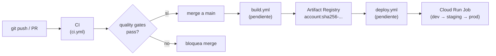

# CI/CD

## Estado actual

| Workflow | Estado | Descripción |
| -------- | ------ | ----------- |
| `ci.yml` — quality gates | Implementado | Lint, formato, tipos, tests, commits en cada push/PR |
| `release.yml` — versión y changelog | Implementado | `cz bump` + `git push --follow-tags` (manual) |
| `build.yml` — build de imagen | Pendiente (IaC) | Build → Artifact Registry |
| `deploy.yml` — deploy a Cloud Run | Pendiente (IaC) | Promote por digest → Cloud Run Job |

## Estrategia de entrega

Trunk-based development: ramas de feature cortas → merge a `main`. Cada merge
activa el workflow de CI.

El build y el deploy son workflows separados del CI: la misma imagen (por digest)
se promueve de `dev` → `staging` → `prod` sin reconstruir. Esta separación es
intencional: lo que se verifica en CI es el código; lo que se despliega es la
imagen construida una sola vez.

## Workflow CI (`ci.yml`)

Se activa en:
- Push a `main`
- Pull request (cualquier rama)

Pasos en orden:
1. `uv sync --all-packages`
2. `uv run ruff check .` — lint
3. `uv run ruff format --check .` — formato
4. `uv run mypy` — tipos (strict)
5. `uv run pyright` — tipos (IDE-parity)
6. `uv run pytest` — tests (con pytest-randomly)
7. `uv run cz check --rev-range ...` — convención de commits (solo en PRs)

## Workflow Release (`release.yml`)

Activación: manual (`workflow_dispatch`).

Pasos:
1. `uv sync --all-packages`
2. `uv run cz bump --yes --changelog` — incrementa versión según conventional
   commits y actualiza `CHANGELOG.md`
3. `git push --follow-tags` — empuja el commit de versión y el tag `vX.Y.Z`

La versión sigue el esquema `pep440`, configurada en `[tool.commitizen]` del
`pyproject.toml`.

## Build de imagen (pendiente — IaC)

El build se ejecuta desde la **raíz del repositorio** (contexto del workspace):

```bash
docker build -f jobs/account/Dockerfile -t <registry>/<project>/account:<sha> .
```

La imagen usa un build multi-stage distroless:
- **Builder**: `python:3.11-slim` + `uv` — instala dependencias y construye el
  paquete
- **Runtime**: `gcr.io/distroless/cc-debian12` — sin shell, sin herramientas de
  desarrollo

El `.dockerignore` excluye tests, archivos de desarrollo y `.venv` del contexto
de build.

Una vez construida, la imagen se referencia por **digest inmutable**
(no por tag mutable) para garantizar trazabilidad y rollback determinístico.

## Infraestructura pendiente (repositorio de IaC)

Los siguientes recursos se definen en el repositorio de infraestructura separado:

| Recurso | Estado |
| ------- | ------ |
| Artifact Registry repository | Pendiente |
| Cloud Run Job (por módulo) | Pendiente |
| Datasets de BigQuery (IaC-owned) | Pendiente |
| Inyección de `GOOGLE_LOCATION` en Cloud Run env | Pendiente |

> Los datasets de BigQuery (`BQ_DATASET_RAW`, `BQ_DATASET_CONTROL`) son
> responsabilidad del IaC, no de la aplicación. La app solo crea tablas
> (`create_tables()`), nunca datasets.

## Flujo completo


