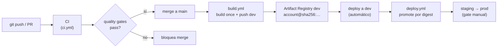

# CI/CD

## Estado actual

| Workflow | Estado | Descripción |
| -------- | ------ | ----------- |
| `ci.yml` — quality gates | Implementado | Lint, formato, tipos, tests, commits en cada push/PR |
| `release.yml` — versión y changelog | Implementado | `cz bump` + `git push --follow-tags` (manual) |
| `build.yml` — build de imagen | Implementado | Build once → push a registry dev → deploy a dev |
| `deploy.yml` — promote a Cloud Run | Implementado | Promote por digest → Cloud Run Job (gate por entorno) |

## Estrategia de entrega

Trunk-based development: ramas de feature cortas → merge a `main`. Cada merge
activa el workflow de CI.

El build y el deploy son workflows separados del CI: la misma imagen (por digest)
se promueve de `dev` → `staging` → `prod` sin reconstruir. Esta separación es
intencional: lo que se verifica en CI es el código; lo que se despliega es la
imagen construida una sola vez.

## Workflow CI (`ci.yml`)

Se activa en:
- Push a `main`
- Pull request (cualquier rama)

Pasos en orden:
1. `uv sync --all-packages`
2. `uv run ruff check .` — lint
3. `uv run ruff format --check .` — formato
4. `uv run mypy` — tipos (strict)
5. `uv run pyright` — tipos (IDE-parity)
6. `uv run pytest` — tests (con pytest-randomly)
7. `uv run cz check --rev-range ...` — convención de commits (solo en PRs)

## Workflow Release (`release.yml`)

Activación: manual (`workflow_dispatch`).

Pasos:
1. `uv sync --all-packages`
2. `uv run cz bump --yes --changelog` — incrementa versión según conventional
   commits y actualiza `CHANGELOG.md`
3. `git push --follow-tags` — empuja el commit de versión y el tag `vX.Y.Z`

La versión sigue el esquema `pep440`, configurada en `[tool.commitizen]` del
`pyproject.toml`.

## Workflow Build (`build.yml`)

Se activa en push a `main` (cambios en `jobs/`, `packages/`, `pyproject.toml`,
`uv.lock`) y por `workflow_dispatch`. Autentica a GCP por Workload Identity
Federation (sin keys), construye desde la **raíz del repositorio** y deploya a
`dev`:

1. `google-github-actions/auth` con el provider WIF del entorno `dev`
2. `docker build -f jobs/<módulo>/Dockerfile -t <registry>/<módulo>:<sha> .`
3. `docker push` y resolución del **digest** (`gcloud artifacts docker images describe`)
4. `gcloud run jobs update datalake-<módulo>-dev --image <registry>/<módulo>@<digest>`

La imagen es multi-stage distroless (builder `python:3.11-slim` + `uv`, runtime
`gcr.io/distroless/cc-debian12`); el `.dockerignore` excluye tests y artefactos
de desarrollo. Se construye **una sola vez** y se referencia por **digest
inmutable** para trazabilidad y rollback determinístico.

## Workflow Deploy (`deploy.yml`)

Activación: `workflow_dispatch` con `module`, `target` (`dev`/`staging`/`prod`) e
`image` (ref con `@sha256:` de una corrida de Build). Corre en el GitHub
Environment del `target`, que aporta sus variables y el gate de revisores:

1. Auth WIF con el deploy SA del entorno target
2. Promote: `gcloud artifacts docker images copy` del digest al registry target
   (preserva el digest, sin rebuild); en `dev` la imagen ya está y se omite
3. `gcloud run jobs update datalake-<módulo>-<target> --image …@<digest>`

> El promote cross-project (dev→staging/prod) requiere que el deploy SA del
> entorno target tenga `artifactregistry.reader` sobre el registry de `dev`.

### Configuración requerida (GitHub Environments)

Cada entorno (`dev`, `staging`, `prod`) define estas variables (no secrets):

| Variable | Origen |
| -------- | ------ |
| `WIF_PROVIDER` | output `wif_provider_name` del módulo IaC |
| `DEPLOY_SA_EMAIL` | output `deployer_service_account_email` |
| `AR_REPOSITORY` | output `artifact_registry_repository` |
| `AR_LOCATION` | región del registry (ej. `us-central1-docker.pkg.dev`) |
| `REGION` | región GCP (ej. `us-central1`) |
| `GCP_PROJECT` | proyecto del entorno (`data-lake-<env>`) |

`staging` y `prod` deben configurar **required reviewers** para gatear el deploy.

## Flujo completo

